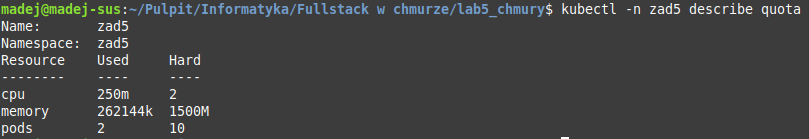
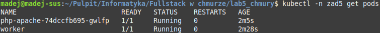
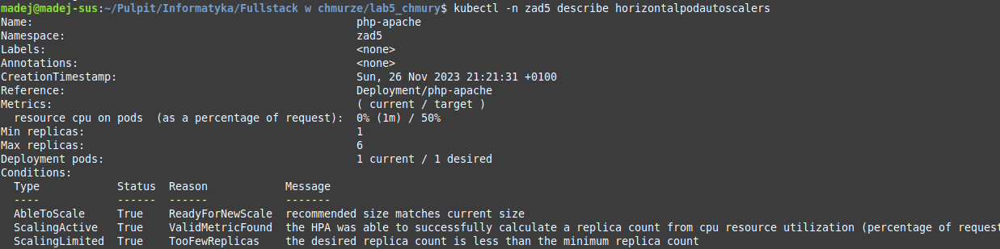
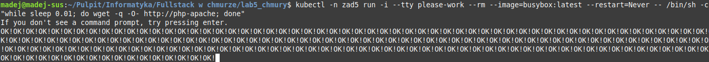
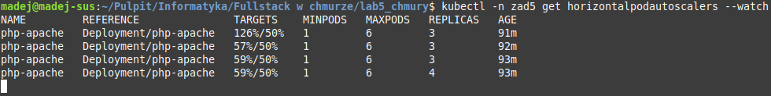

# Laboratorium 5
## Programowanie Full-Stack w Chmurze Obliczeniowej
## Kacper Madejczyk, 92937

### Czynności wstępne
Uruchomienie lokalnego klastra minikube i utworzenie przestrzeni nazw `zad5`:
```
minikube start
kubectl create namespace zad5
```

### Zadanie 1
Określiłem zestaw ograniczeń na zasoby w pliku [create_quota.yaml](./create_quota.yaml), który wygenerowałem przy pomocy komendy:
```
kubectl create quota zad5 -n zad5 --hard=pods=10,cpu=2000m,memory=1.5G --dry-run=client -o yaml > create_quota.yaml
```

### Zadanie 2
Plik yaml tworzący poda _worker_ o specyfikacji określonej w treści zadania: [worker.yaml](./worker.yaml).

### Zadanie 3
Aby wykonać zadanie, zmodyfikowałem kod z listingu z dokumentacji Kubernetesa wskazanego w treści zadania. Rezultatem modyfikacji jest plik [php_apache.yaml](./php_apache.yaml).

### Zadanie 4
Zamiast parametru `targetCPUUtilizationPercentage` użyłem parametru `averageUtilization`, ponieważ ten poprzedni już nie jest obsługiwany.

Definicję autoskalera umieściłem w pliku [hpa.yaml](./hpa.yaml). Ustawiłem wartość parametru `maxReplicas` na 6, aby nie dopuścić do sytuacji, w której zostałyby przekroczone ograniczenia zasobów dla przestrzeni nazw `zad5`. Jeśli każda z 6 replik wykorzystałaby całą dostępną dla siebie ilość pamięci RAM (po 250 MB każda), to zostałaby wykorzystana cała pamięć określona w limicie (1500 MB). Limit wykorzystania CPU dla przestrzeni nazw wynosi 2000m, wszystkie repliki razem wzięte mogą używać maksymalnie 1500m, więc w tym przypadku limit na pewno nie zostanie przekroczony.

### Zadanie 5
Utworzyłem obiekty zadeklarowane we wcześniej opracowanych plikach yaml przy pomocy następujących poleceń:
```
kubectl apply -n zad5 -f create_quota.yaml
kubectl apply -n zad5 -f worker.yaml
kubectl apply -n zad5 -f php_apache.yaml
kubectl apply -n zad5 -f hpa.yaml
```

Sprawdzenie, czy ograniczenie zasobów zostało poprawnie nałożone:
```
kubectl -n zad5 describe quota
```



Sprawdzenie czy poprawnie utworzono pody zdefiniowane w `worker.yaml` oraz `php_apache.yaml`:
```
kubectl -n zad5 get pods
```



Sprawdzenie czy autoskaler został poprawnie utworzony:
```
kubectl -n zad5 describe horizontalpodautoscalers
```



### Zadanie 6
Nałożyłem ograniczenie zasobów zdefiniowane w pliku `limit_range.yaml` na przestrzeń nazw przed uruchomieniem aplikacji generującej obciążenie:
```
kubectl apply -n zad5 -f limit_range.yaml
```

Komenda uruchamiająca aplikację generującą obciążenie dla `php-apache`:
```
kubectl -n zad5 run -i --tty please-work --rm --image=busybox:latest --restart=Never -- /bin/sh -c "while sleep 0.01; do wget -q -O- http://php-apache; done"
```

Wynik wykonania komendy:



Dowód na poprawne działanie autoskalera (dynamicznie zwiększona liczba replik):



